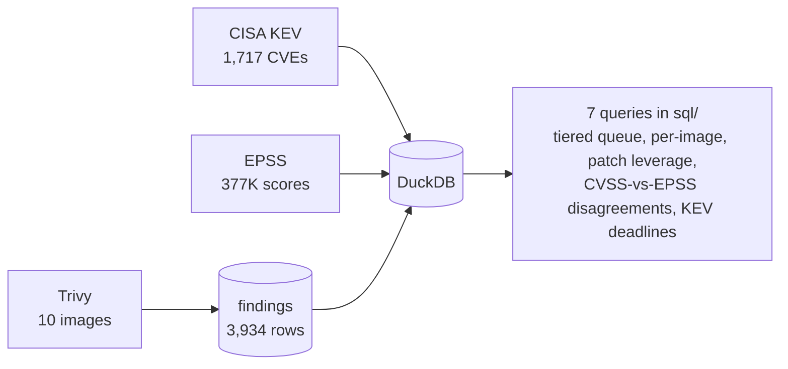
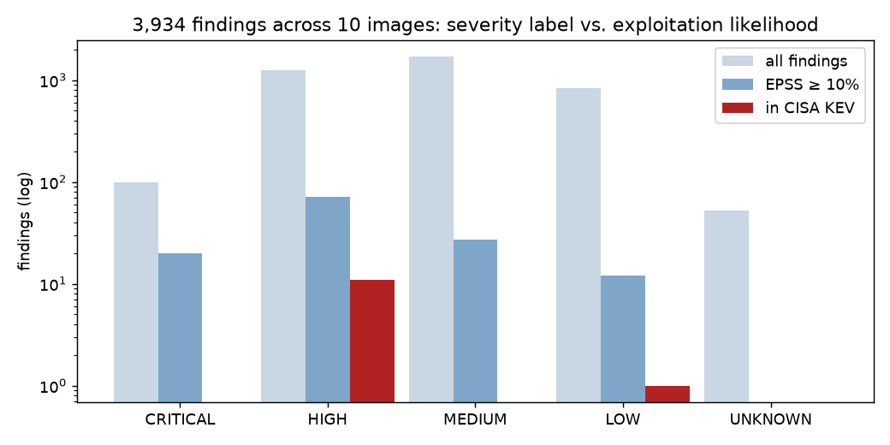

# Vulnerability Prioritization

Trivy scans of ten container images, enriched with **CISA KEV** (what is being exploited) and
**EPSS** (what is likely to be), then prioritised in SQL into a work queue a team can actually
execute — instead of a list of 3,934 CVEs sorted by CVSS.



## The result (scan of 2026-09-22, KEV 2026.09.21, EPSS 2026-09-21)

| tier | rule | findings | share |
|---|---|---:|---:|
| **P0** | in CISA KEV and a fix exists — patch this week | 11 | 0.3 % |
| **P1** | EPSS ≥ 10 % (top ~5 % most likely exploited), fixable — this sprint | 84 | 2.1 % |
| P2 | CRITICAL/HIGH, EPSS ≥ 1 %, fixable — next sprint | 399 | 10.1 % |
| P3 | fixable, low likelihood — routine cadence | 1,591 | 40.4 % |
| P4 | no fix available — track, mitigate or accept | 1,849 | 47.0 % |

**95 findings (2.4 %) are the real work.** A "fix all CRITICAL and HIGH" policy would have queued
1,362, of which only 11 are known-exploited and 92 have meaningful exploit probability.



Findings worth repeating in an interview:

- **`nginx:1.27` — a current image — ships HTTP/2 Rapid Reset (CVE-2023-44487)** in KEV with
  EPSS 1.0, labelled *LOW* by the distro. A severity-sorted report puts it at the bottom
  ([P6](results/06_severity_epss_disagreement.md)).
- **One upgrade closes 432 findings on `node:14`** (`linux-libc-dev` → 4.19.316), including 4 KEV
  entries. Patch the package, not the CVE ([P5](results/05_patch_leverage.md)).
- **EOL images carry the exploited vulnerabilities:** all 11 P0 findings are on `node:14` and
  `nginx:1.18`, both on end-of-life Debian 10. The current equivalents (`node:22-slim`,
  `nginx:1.27`) have 1 and 5 findings with EPSS ≥ 10 % respectively ([P4](results/04_by_image.md)).
- **47 % of findings have no fix available.** Half the list is not a patching problem; it is a
  risk-acceptance and compensating-control conversation.
- `alpine:3.20` had zero findings and is absent from the tables for that reason.

## The queries

| # | Question | Output |
|---|---|---|
| [01](sql/01_severity_vs_reality.sql) | Findings by CVSS severity vs. KEV and EPSS | the headline table |
| [02](sql/02_priority_queue.sql) | The tiered work queue, ordered by EPSS then CVSS | [results/02](results/02_priority_queue.md) |
| [03](sql/03_tier_summary.sql) | How much work is in each tier | the slide for the manager |
| [04](sql/04_by_image.sql) | Per-image risk, EOL status, fixability | what to rebase first |
| [05](sql/05_patch_leverage.sql) | Which single package upgrades close the most | the actual patch tickets |
| [06](sql/06_severity_epss_disagreement.sql) | Where CVSS and EPSS disagree, both directions | what a severity-only policy gets wrong |
| [07](sql/07_kev_deadlines.sql) | KEV hits with CISA's due dates | SLA evidence |

## Run it

```bash
git clone https://github.com/prhoguns/vuln-prioritization.git && cd vuln-prioritization
pip install -r requirements.txt
python scripts/build_db.py && python scripts/run.py     # uses the committed scans and feeds: ~10 s
```

Refresh with your own images and today's feeds:

```bash
./scripts/fetch_feeds.sh          # KEV + EPSS, no account needed
./scripts/scan.sh                 # edit the IMAGES list; needs Docker
python scripts/build_db.py && python scripts/run.py
```

## Why this tiering

CVSS measures how bad exploitation *would* be; it says nothing about whether anyone is exploiting
it. KEV is a list of CVEs with confirmed exploitation in the wild (CISA, updated most weekdays).
EPSS is a daily probability (0–1) that a CVE will be exploited in the next 30 days, from FIRST.
The tiers use KEV as the hard trigger, EPSS as the ranking signal, and CVSS only as a tiebreaker —
which is the order SSVC and most modern vulnerability-management guidance recommends. "Fixable"
matters because a finding with no vendor fix is a different kind of work.

## Next

- Reachability: is the vulnerable function actually called? (Trivy + a call-graph tool, or Grype + Syft SBOM.)
- Asset context: internet-facing × KEV = P0 regardless of fix; internal batch job × P1 = P2.
- Export the queue to Jira, one ticket per (image, package) from P5.
- Track over time: re-scan weekly, chart P0+P1 count — the number a CISO wants to see go down.
